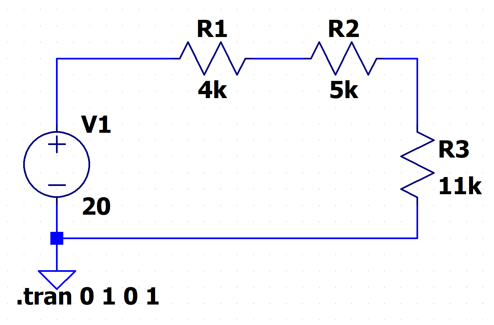
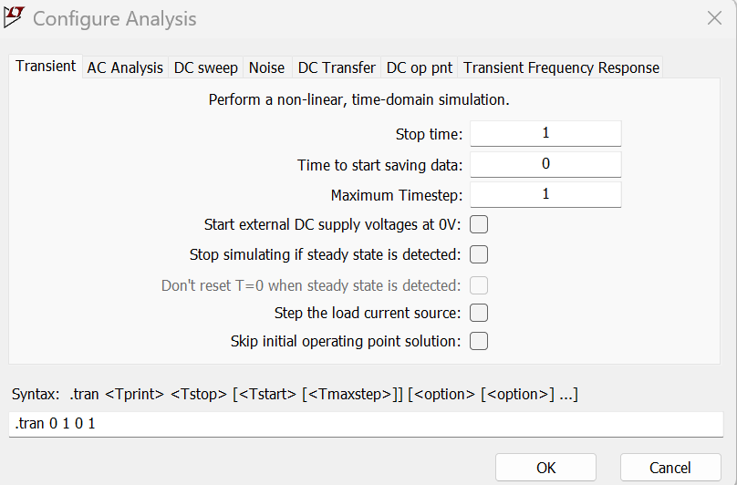
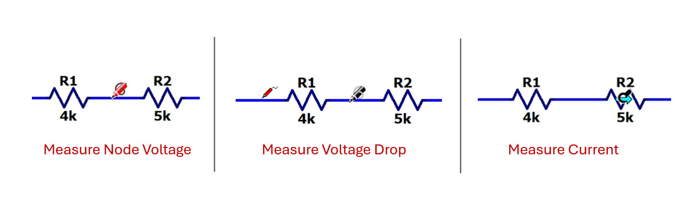

[← Back to overview](README.md)

# Problem 1. 3-Resistor Circuit

## Task

In LTSpice, build this circuit with resistors.

Practice with the hotkey usage. You can find details in the [LTspice keyboard shortcuts reference](https://www.analog.com/media/en/news-marketing-collateral/solutions-bulletins-brochures/ltspice-keyboard-shortcuts-ink-saver.pdf).

A few useful ones:

| Action | Hotkey |
|---|---|
| Voltage source | `V` |
| Resistor | `R` |
| Wire | `W` |
| Ground | `G` |
| Move a component | `M` |
| Rotate a component | `Ctrl + R` |
| Zoom in/out | Middle mouse button |

--------
Once you finish placing components, go to **Analysis** and configure it as **Transient**.

----------

On your circuit schematic, hover your mouse cursor and performance voltage and current measurement.
-	**Measure Node Voltage:** Hover the mouse over a wire/node and click to plot the voltage at that node.
-	**Measure Voltage Drop:** Hold Ctrl, click and drag from one end of a component to the other end, then release to plot the voltage drop across the component.
-	**Measure Current:** Hover the mouse over a component and click to plot the current through that component.

-----

## :orange: Required in your homework answer

1. Include a screenshot of the plot of the node voltage between R1 and R2.
2. Include a screenshot of the plot of the voltage drop across R1.
3. Include a screenshot of the plot of the current flowing thru R2.
