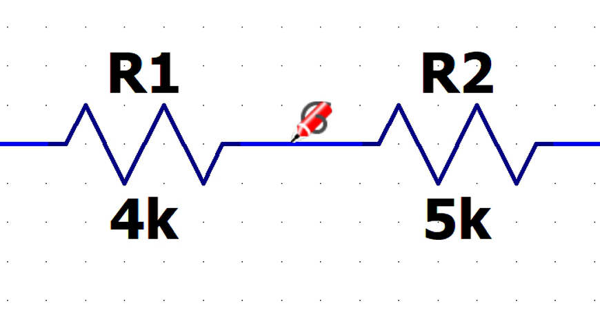

[← Back to overview](README.md)

# Problem 1. Hotkeys — 4 pts

## Task

In LTspice, build this circuit with resistors.

Practice with the hotkey usage. You can find details in the [LTspice keyboard shortcuts reference](https://www.analog.com/media/en/news-marketing-collateral/solutions-bulletins-brochures/ltspice-keyboard-shortcuts-ink-saver.pdf).

A few useful ones:

| Action | Hotkey |
|---|---|
| Voltage source | `V` |
| Resistor | `R` |
| Wire | `W` |
| Ground | `G` |
| Move a component | `M` |
| Rotate a component | `Win + R` |
| Zoom in/out | Middle mouse button |

Once you finish placing components, go to **Analysis** and configure it as **Transient**.

## ✅ Required in your answer

*The original document doesn't list explicit "In answer" bullets for this problem — it just asks you to build the circuit above with resistors, using the hotkeys, and set up the Transient analysis as shown.*
