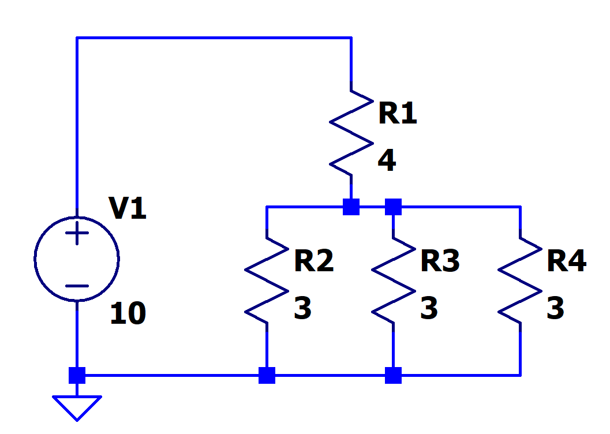

[← Back to overview](README.md)

# Problem 2. 4-Resistor Circuit

## Task

In LTSpice, build this circuit with resistors.

Configure Analysis -> Transient.

Stop Time: 0; Time to start saving data 0; Max timestep: 1

Hover your mouse cursor over each resistor. At the bottom of the LTspice window, you can see the power dissipation of that resistor.

-----

## :orange: Required in your homework answer

1. Include a screenshot of the plot of the current flowing thru R1
1. Include a screenshot of the plot of the voltage drop across R1
3. Include a screenshot the power dissipation of R1 shown by LTspice
4. Calculate the power dissipated by R1 yourself, using the formula $P=V\cdot I$
