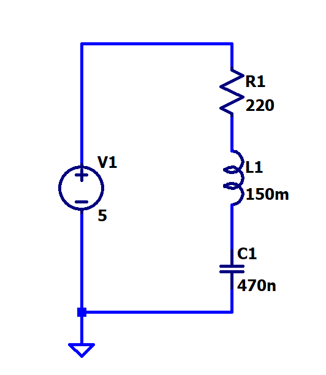
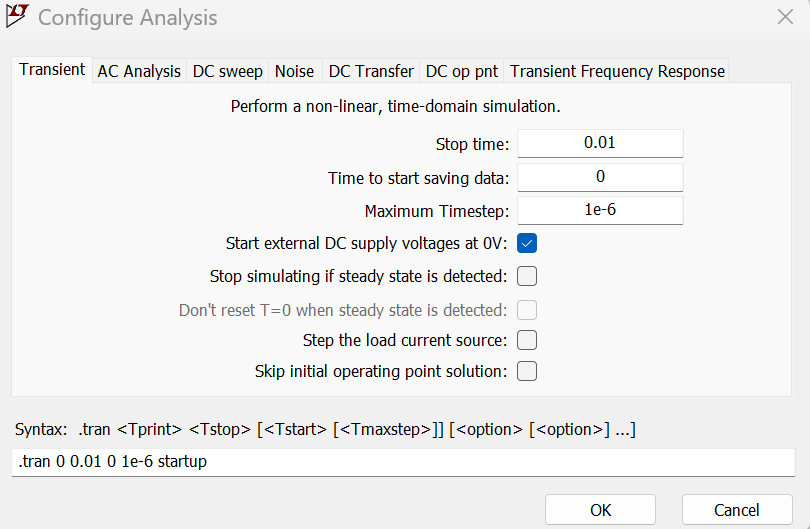

[← Back to overview](README.md)

# Problem 3. RLC

## Task

In LTSpice, build this circuit with one resistor, one capacitor, one inductor.

Configure "Analysis" as "Transient" and as the following spec:

One extra notice is to tick the box "start external DC power supply at 0V"

-----

## :orange: Required in your homework answer

1. Calculation: convert "150 mH" to "H". convert "470 nF" to "F".
2. Include a screenshot of the plot of the node voltage at the node between the inductor and capacitor.
3. Include a screenshot of the plot of the current flowing thru the resistor.

*(hint: both 2. and 3. plots would look like a damped sine wave)*
