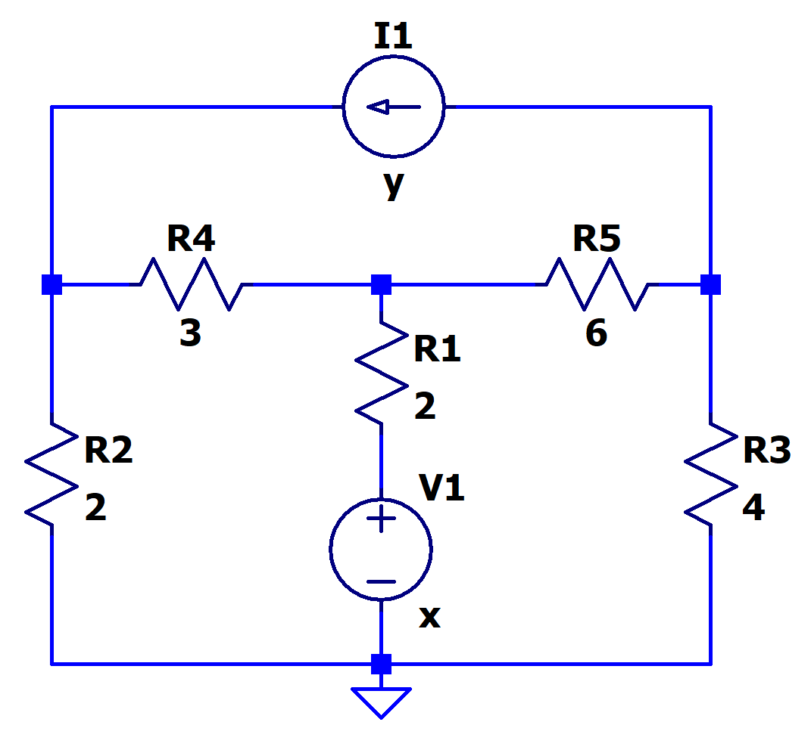
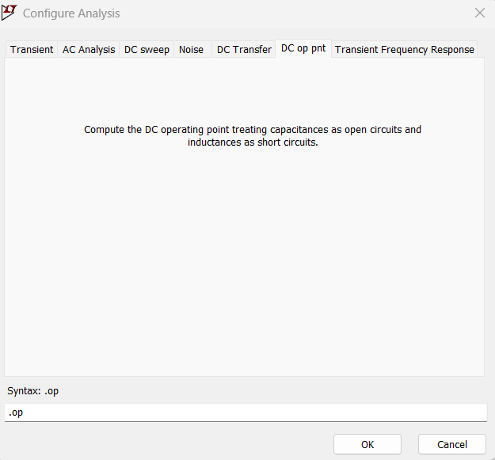

[← Back to overview](README.md)

# Problem 4. Nodes in complex circuit

## Task

In LTSpice, build this circuit with one voltage source, one current source, and multiple resistors.

To find a current source, you can simply press ''i" on keyboard, or find it from "Edit"-> "Component"->"Current"

- Set the numerical value of the voltage source as x V.
- Set the numerical value of the current source as y A.
- x, y values have been specified on the [README page](README.md)

----

With LTSpice, you can quickly check how many distinct nodes in a circuit. To do so, configure the "Analysis" to "DC op pnt" (DC operating point analysis).

Run the analysis, you will get a pop-out window showing you the report.

-----

## :orange: Required in your homework answer

1. Include a screenshot of the plot of the node voltage between R1 and R2.
2. Include a screenshot of the plot of the voltage drop across R1.
3. Include a screenshot of the plot of the current flowing thru R2.
