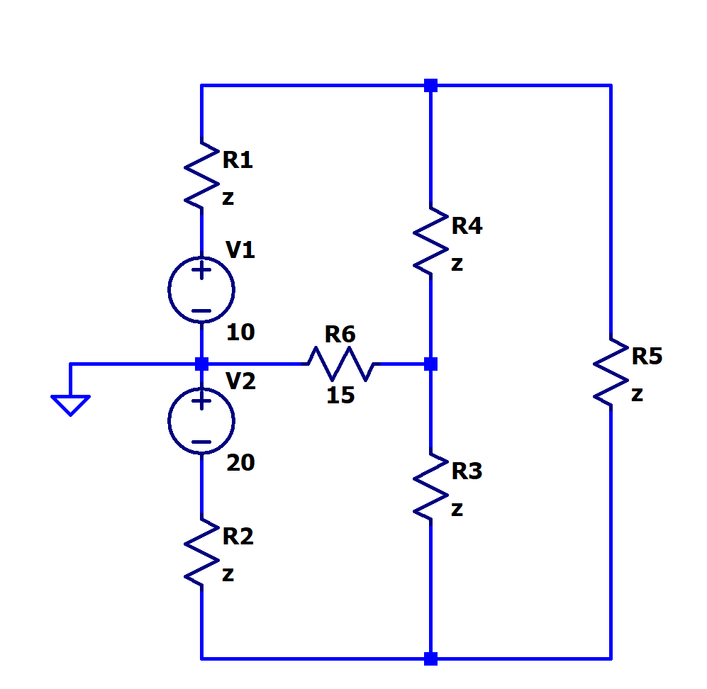

[← Back to overview](README.md)

# Problem 5. Nodes in a More Complex Circuit

## Task

In LTSpice, build this circuit.

- Set the numerical value of all resistors as z Ω.
- z value has been specified on the [README page](README.md)

----

Similarly as Problem 4. Run the DC operating point analysis (DC op pnt). 

-----

## :orange: Required in your homework answer

1. Include a screenshot of your circuit schematic.
2. Include a LTSpice report of the DC operating point analysis. (*direct paste the list result*)
3. Indicate how many distinct nodes are in the circuit (except Ground).
4. Based on what you learned from class/textbook, indicate which nodes are extraordinary nodes (except Ground).
