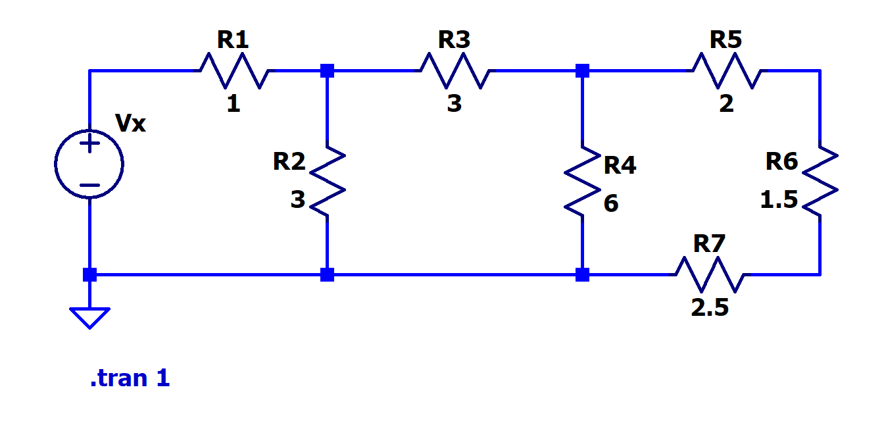

[← Back to overview](README.md)

# Problem 1. Ladder Circuit

## Task

In LTSpice, build this circuit with resistors.

Set the voltage source value $V_x$ = x, 

x value has been specified on the [README page](README.md)

--------
Once you finish placing components, go to **Analysis** and configure it as **Transient**. Stop Time 1, others leave as empty.

Hover your mouse cursor over the voltage source. 

Then click and use the plot to check what is the current thru the voltage source.

-----

## :orange: Required in your homework answer

1. Include a screenshot of the plot of the current thru the voltage source, $I_x$.

2. Include a quick calculation of Equivalent Resistance $R_{eq}$ based on $R_{eq}=V_x/I_x$.

3. Include a detailed derivation and calculation of Equivalent Resistance $R_{eq}$ based on series-parallel reduction, like what you show in recitation worksheet. 

   *(You may write the calculation by hand, take a clear photo, and insert the photo into the same document that you work on.)*
