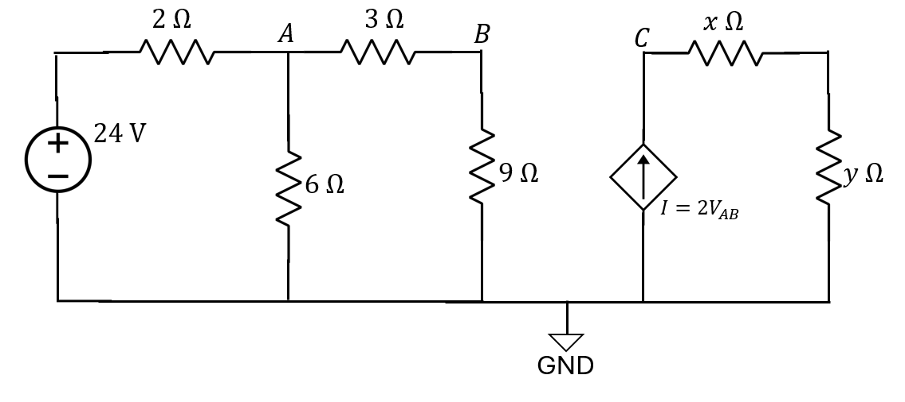
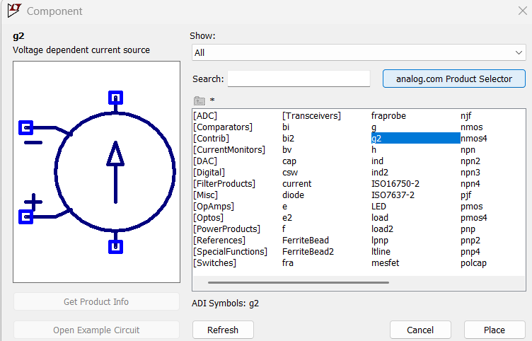
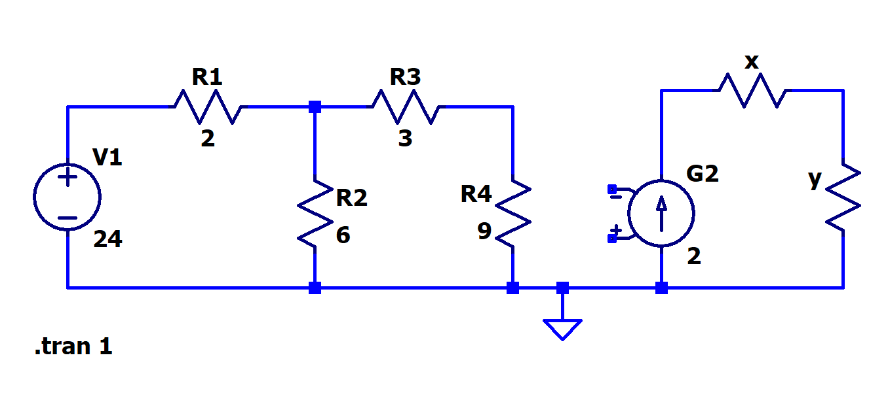
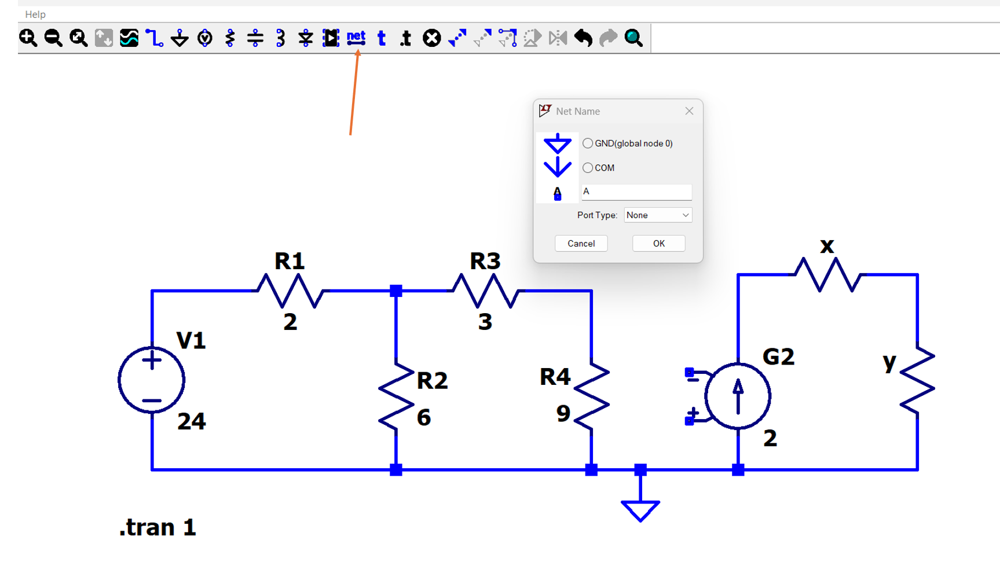
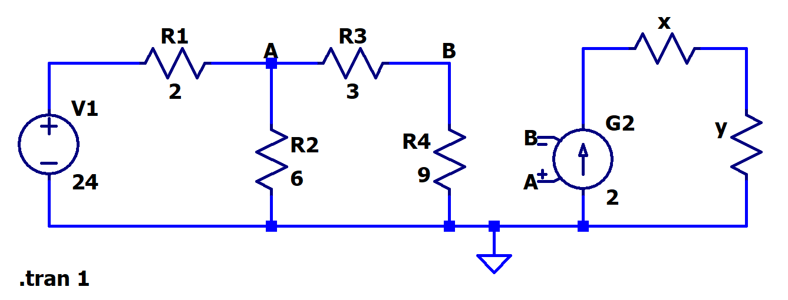

[← Back to overview](README.md)

# Problem 2. Voltage-Controlled Current Source (VCCS)

## Task

In LTSpice, build this circuit with resistors.

#### How to build a voltage-controlled source in LTSpice

- [ ] Go to "Component", find the one named "g2". Place it
- [ ] Right click to configure the value of "g2" to be 2.

- [ ] Add other components, make the circuit schematic look like such,

Next, we need to realize the $I=2V_{AB}$ in this circuit. 
- [ ] To do so, we use the "Label Net" in LTSpice to establish the electrical connection from Node A, NodeB to the dependent source.
- [ ] Label two nodes on the left loop as "A" and "B"; Then label the two extra terminals of the dependent source also as "A" and "B".
  In Label Net, "Port Type" all set to "None"

- [ ] Final schematic should look like such. Also don't forget to use your assigned x, y values from [README page](README.md)

---------

Configure Analysis -> Transient. Stop Time 1, others leave as empty.

Hover your mouse cursor to check the node voltage $V_C$ at Node C (*see the 1st pic, the node between dependent source and x Ω R*)

-----

## :orange: Required in your homework answer

1. Include a screenshot of your circuit schematic in LTSpice
2. Include a screenshot of the plot of the node voltage at Node C
3. Include a detailed derivation and calculation of $V_{AB}$ and $V_C$ using circuit analysis, like what you show in recitation worksheet. 
   *(You may write the calculation by hand, take a clear photo, and insert the photo into the same document that you work on.)*

> **Note:** For 3., Full steps are required for full credit.
