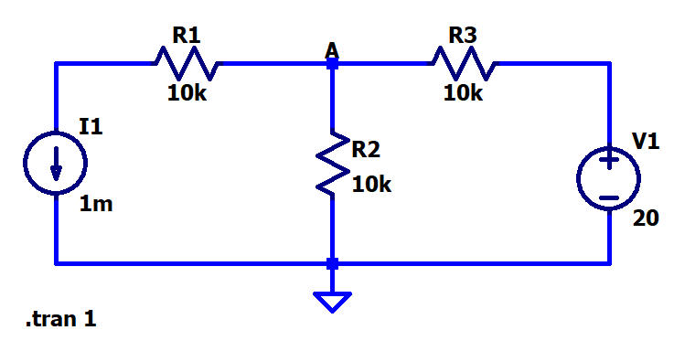
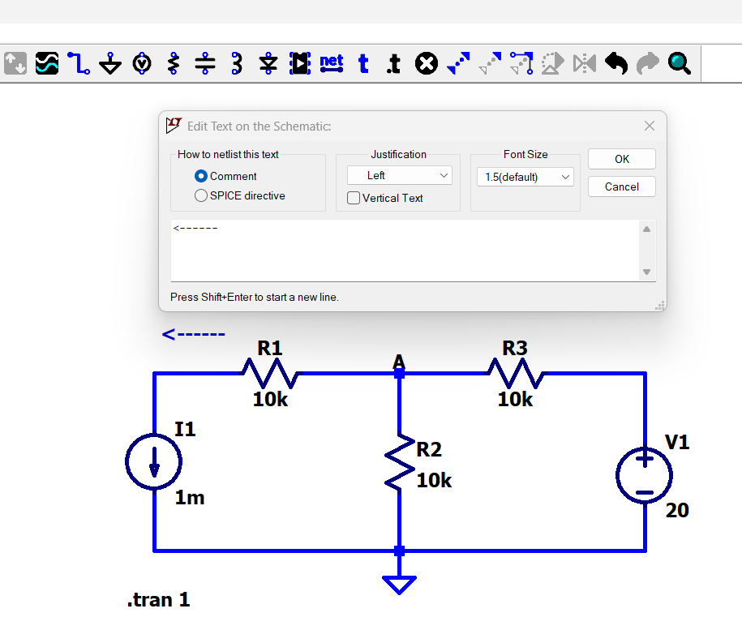

[← Back to overview](README.md)

# Problem 3. KCL

## Task

In LTSpice, build this circuit with resistors.

- [ ] Configure Analysis -> Transient. Stop Time 1, others leave as empty.

- [ ] Use the plots to inspect the **3 currents around the Node A.**

- [ ] Use the "Text" (blue t on top bar) in LTSpice to label all 3 current values and directions around the Node A.
 Here is an example that I label one current. You still need to label the other two.

-----

## :orange: Required in your homework answer

1. Include 3 screenshots of your 3 current plots, respectively 
2. Include a screenshot of your final circuit schematic, with all 3 current values and directions labeled.
3. Include a single equation calculation to justify whether it follows KCL.
