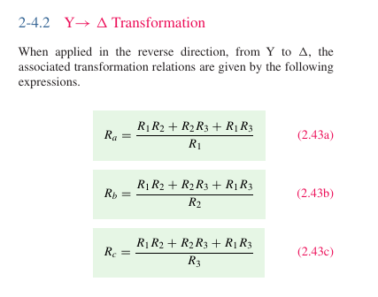

[← Back to overview](README.md)

# Problem 4. Y-Δ circuit transform

## Task

Although Y-Δ transform will not be in the exam, I still want to show an example here in homework.

| Y (or T) topology | Δ (or Π) topology |
|---------------------|------------------------------|
|  |  |

Above, the two circuits are equivalent. Their transform relationship is described in textbook 2-4.2. I pasted here:

- [ ] Apply these equations, calculate the $R_a$, $R_b$, $R_c$ values for the right circuit (Δ topology).
- [ ] Build both circuit in LTSpice (2 seperate files). Configure Analysis -> Transient. Stop Time 1, others leave as empty.
- [ ] Inspect the currents thru the voltage source in both circuits in LTSpice. You should get the same value since they are equivalent.

-----

## :orange: Required in your homework answer

1. Indicate your $R_a$, $R_b$, $R_c$ values
2. Include a screenshot of circuit schematic of your Y topology circuit (left circuit) in LTSpice
3. Include a screenshot of circuit schematic of your Δ topology circuit (right circuit) in LTSpice
4. Indicate the currents thru the voltage source in both circuits.
