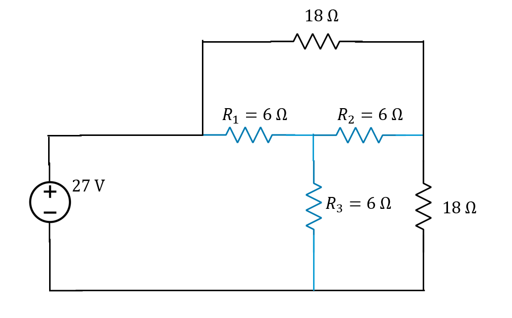
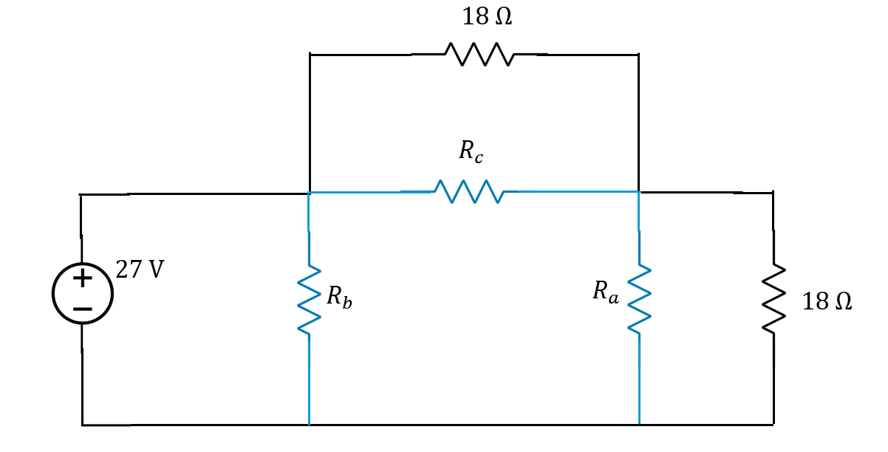

[← Back to overview](README.md)

# Problem 4. Y-Δ circuit transform

## Task

Although Y-Δ transform will not be in the exam, I still want to show an example here in homework.

| Y (or T) topology | Δ (or Π) topology |
|---------------------|------------------------------|
|  |  |

Above, the two circuits are equivalent. Their transform relationship is described in textbook 2-4.2. I pasted here:

-----

## :orange: Required in your homework answer

1. Include a screenshot of the plot of the current flowing thru R1
2. Include a screenshot of the plot of the voltage drop across R1
3. Include a screenshot the power dissipation of R1 shown by LTSpice
4. Calculate the power dissipation of R1 yourself. Use the formula $P=V\cdot I$, and with the current and voltage readings from LTSpice.
