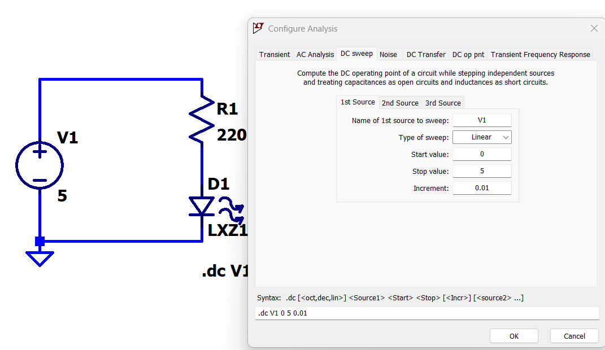

[← Back to overview](README.md)

# Problem 5. LED

## Task

In LTSpice, build this circuit with resistor and LED.

||
|---|
||

- [ ] To find the LED, go to "Component", then "LED"
- [ ] Once placed on schematic, right click the led symbol, go to "Pick New Diode"
- [ ] You  pick a specific LED **based on your major**: 
  EE, CE: LXZ1-PB01; ME: LXZ1-PD01; AE: LXZ1-PE01; Other: LXZ1-PH02
  These all appear at the very end of the list.

- [ ] Then "Configure Analysis", "DC sweep", source as "V1", linear, start 0, stop 5, increment 0.01.
- [ ] OK, then click the current thru the LED, you will get an i-v curve plot

-----

## :orange: Required in your homework answer

1. Indicate your major and the LED model you used
2. Search online for your led model, indicate its color
3. Include a screenshot your circuit schematic in LTSpice
4. Include a screenshot your i-v curve plot of the LED
